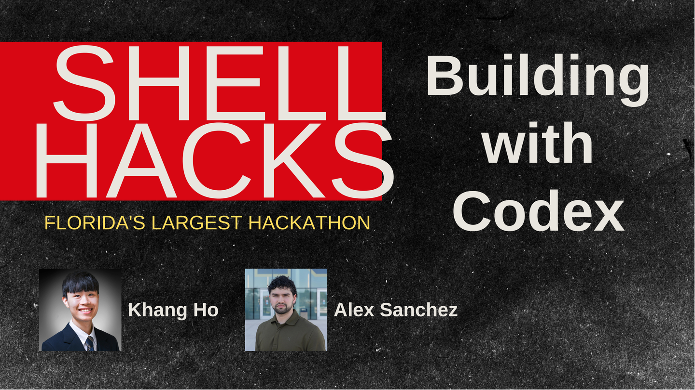

# ShellHacks 2026 - "Building with Codex" Demo 1

This is the code for the ShellHacks 2026 AI workshop, "Building with Codex". The code in-and-of itself is not the main focus,
but instead the ideas of context engineering and understanding the Codex coding harness. Attached will be the slides
for the event.

## Presentation

[View the presentation (PDF)](docs/presentation/shellhacks-2026-building-with-codex.pdf)
